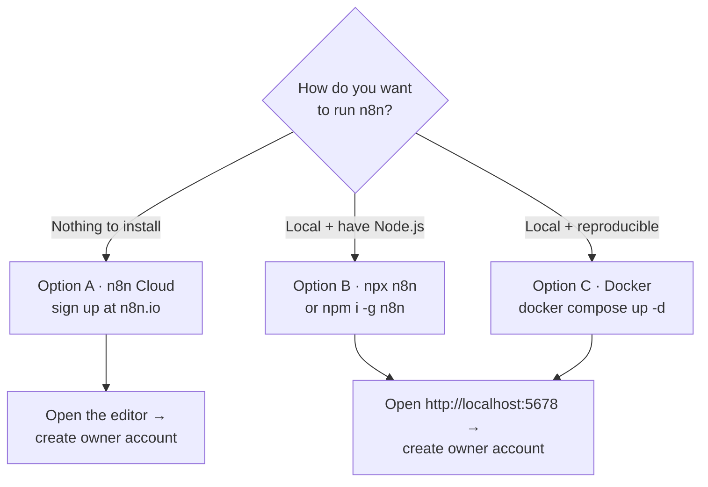
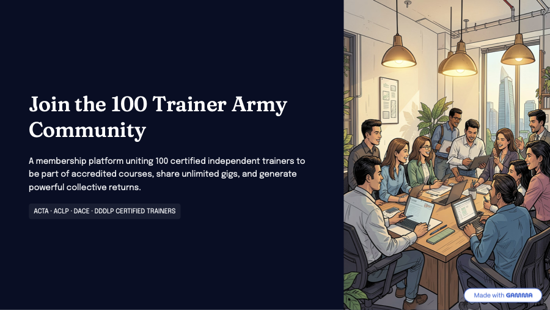
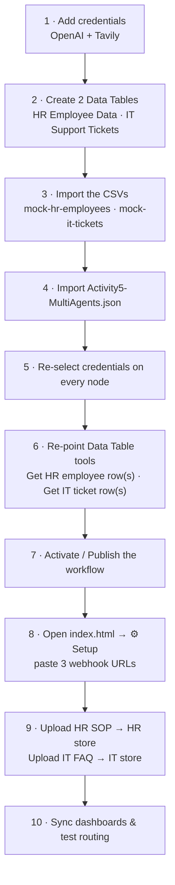
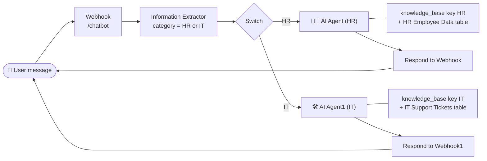
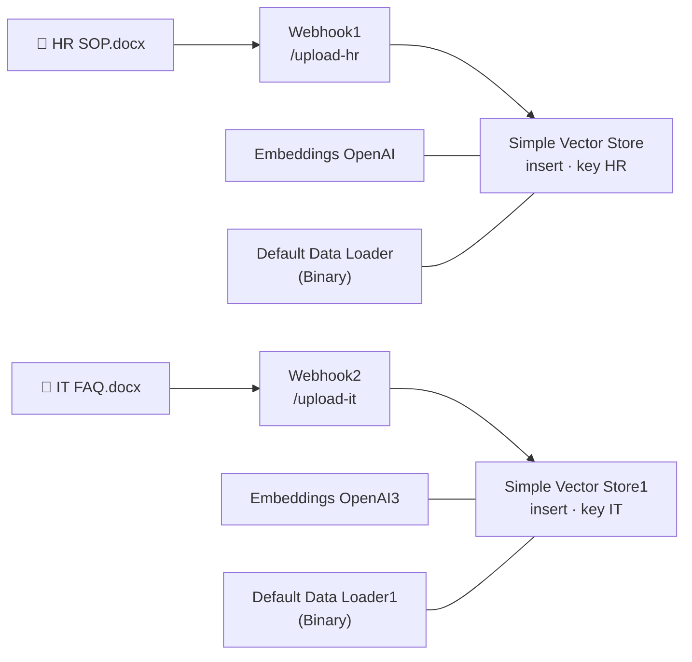

# Agentic AI Automation with n8n — Step‑by‑Step Lab Guide

**Course Code:** TGS-2023035977
**Course page:** https://www.tertiarycourses.com.sg/wsq-agentic-ai-automation-with-n8n.html

This guide walks you through every hands‑on activity in the course. Each activity builds on the previous one, taking you from a simple form‑to‑email automation all the way to a Retrieval‑Augmented Generation (RAG) chatbot and a multi‑agent router with a custom web front end.

> The completed workflow exports (`.json`) and web pages (`.html`) for every activity are in the matching folders:
> `activity1-automation/`, `activity2-ai-agent/`, `activity3-webhook/`, `activity4-rag/`, `activity5-multi-agents/`.
> You can import any `.json` into n8n to compare against your own build.

---

## Table of Contents

1. [Before You Start — Setup & Prerequisites](#0-before-you-start)
2. [Activity 1 — Workflow Automation with Forms](#activity-1)
   - [1a — Design a Flyer with an n8n Form (Form → Email)](#activity-1a)
   - [1b — Conditional Routing with an IF node](#activity-1b)
   - [1c — Saving Submissions to a Data Table](#activity-1c)
3. [Activity 2 — Build an AI Agent (Chat + Tools + Memory)](#activity-2)
4. [Activity 3 — Expose the Agent via a Webhook + Custom Web UI](#activity-3)
5. [Activity 4 — RAG Chatbot with Vector Store & File Upload](#activity-4)
6. [Activity 5 — Multi‑Agent Router (HR + IT Support)](#activity-5)
   - [5.1 — How the routing works](#activity-5-how)
   - [5.2 — Build the Information Extractor (classifier)](#activity-5-extractor)
   - [5.3 — Build the Switch (router)](#activity-5-switch)
   - [5.4 — Build the HR agent](#activity-5-hr)
   - [5.5 — Build the IT Support agent](#activity-5-it)
   - [5.6 — Ingestion: upload HR SOP + IT FAQ](#activity-5-ingest)
   - [5.7 — Connect the web page & test routing](#activity-5-test)
7. [Troubleshooting Cheat‑Sheet](#troubleshooting)
8. [Glossary](#glossary)

---

<a name="0-before-you-start"></a>
## 0. Before You Start — Setup & Prerequisites

### 0.1 Accounts & tools you need
| Item | Why | Where |
|---|---|---|
| **n8n account** (Cloud or self‑hosted) | The automation platform used for every activity | https://n8n.io |
| **OpenAI API key** | Powers the LLM (chat model & embeddings) in Activities 2–4 | https://platform.openai.com/api-keys |
| **Tavily API key** | Web‑search tool for the AI Agent | https://tavily.com |
| **Google / Gmail account** | Sending email in Activity 1 | Your Google account |
| **A modern browser** | To open the custom HTML pages in Activities 3–4 | Chrome / Edge / Safari |

### 0.2 Install / run n8n

You need a running n8n before anything else. Pick **one** of the three options below. For these labs, **n8n Cloud** or **npx** are the quickest; **Docker** is the most reproducible for a classroom.



> Whichever you choose, n8n opens at **http://localhost:5678** (self‑hosted) or your cloud URL. On first launch, create the **owner account** (email + password) — this is local to your instance.

#### Option A — n8n Cloud (zero install)
1. Sign up at https://n8n.io → **Get started** → create a workspace.
2. Your editor opens in the browser at a `…app.n8n.cloud` URL. Skip to **0.3**.
   *(Webhook/Production URLs will use your cloud domain instead of `localhost`.)*

#### Option B — npx / npm (local, needs Node.js 18+)
First install **Node.js LTS** (≥ 18) from https://nodejs.org. Check it: `node -v`.

- **Run instantly (no install)** — downloads and starts n8n in one command:
  ```bash
  npx n8n
  ```
- **Or install globally**, then start:
  ```bash
  npm install -g n8n
  n8n           # or: n8n start
  ```
Open **http://localhost:5678** and create your owner account. Stop n8n with **Ctrl‑C** in the terminal. Workflows are saved under `~/.n8n` so they persist between restarts.

#### Option C — Docker (local, reproducible)
First install **Docker Desktop** from https://www.docker.com/products/docker-desktop. Check it: `docker --version`.

A ready‑made compose file is provided in the **[`n8n-installation/`](../n8n-installation/)** folder:

```yaml
# n8n-installation/docker-compose.yml
version: "3.8"
services:
  n8n:
    image: n8nio/n8n
    restart: unless-stopped
    ports:
      - "5678:5678"
    volumes:
      - n8n_data:/home/node/.n8n
    environment:
      - N8N_SECURE_COOKIE=false   # needed for localhost HTTP
volumes:
  n8n_data:
```

Start it (run from inside the `n8n-installation` folder):
```bash
cd n8n-installation
docker compose up -d        # -d = run in the background
```
Then open **http://localhost:5678** and create your owner account.

| Task | Command |
|---|---|
| View logs | `docker compose logs -f` |
| Stop (keep data) | `docker compose down` |
| Update to latest n8n | `docker compose pull && docker compose up -d` |
| Reset everything (⚠️ deletes workflows) | `docker compose down -v` |

> **Why these settings:** the named volume **`n8n_data`** persists your workflows and credentials across restarts, and **`N8N_SECURE_COOKIE=false`** lets n8n load over plain `http://localhost` (without it the login page can refuse to set its session cookie).

### 0.3 Add your credentials in n8n (do this once)
In n8n, credentials are stored centrally and reused by nodes.

1. Open n8n → top‑left menu → **Credentials** → **Add credential**.
2. Create the following:
   - **OpenAI** → paste your OpenAI API key.
   - **Tavily API** → paste your Tavily API key.
   - **Gmail OAuth2** → click **Sign in with Google** and authorise n8n to send mail.
3. You'll select these credentials inside the nodes as you build each workflow.

> **Security tip:** Never paste API keys into the HTML files or share workflow exports that contain secrets. Credentials live only inside n8n's credential store.

### 0.4 How to import a finished workflow (optional reference)
1. In n8n click **Workflows → Add workflow → ⋯ (top‑right) → Import from File**.
2. Choose the `.json` from the activity folder.
3. Re‑select your own credentials on each node (imported credential IDs won't match yours).
4. Click **Save**, then toggle **Active** (or **Published**) when ready.

---

<a name="activity-1"></a>
## Activity 1 — Workflow Automation with Forms

**Goal:** Learn the core n8n building blocks — a **trigger**, **data**, **logic**, and an **action** — by capturing form submissions and emailing them. You'll build three increasingly capable versions.

Folder: [`activity1-automation/`](activity1-automation/)

---

<a name="activity-1a"></a>
### Activity 1a — Design a Flyer with an n8n Form (Form → Email)

**What you'll build:** A hosted enquiry form that emails you each submission.
Reference export: `Activity1a_ Design a Flyer with n8n form embedded.json`

**Workflow shape:** `On form submission (Form Trigger)` → `Send a message (Gmail)`

#### Steps
1. **Create a new workflow** → name it `Activity 1a – Flyer Form`.
2. **Add the trigger:** click **＋ → On form submission** (the n8n **Form Trigger**).
3. **Configure the form:**
   - **Form Title:** `Enquiry Form`
   - **Form Description:** `Enquiry about my service`
   - **Form Fields** (click *Add Field* for each):
     | Field Label | Field Type | Notes |
     |---|---|---|
     | `What's your name?` | Text | |
     | `What's your email` | Email | |
     | `What is your gender` | Radio (Dropdown) | Options: `Male`, `Female` |
     | `What is your favorite food?` | Textarea | |
4. **Add the action:** click the **＋** after the trigger → search **Gmail** → choose **Send a message**.
5. **Configure Gmail:**
   - **Credential:** select your Gmail OAuth2 credential.
   - **To:** your email (e.g. `angch@tertiaryinfotech.com`).
   - **Subject:** `New Enquiry`
   - **Email Type:** HTML.
   - **Message:** use expressions to pull the form answers. Click into the field, switch to **Expression**, and paste:
     ```
     Hi <br><br>
     There is a new enquiry. <br><br>
     Name: {{ $json["What's your name?"] }} <br>
     Email: {{ $json["What's your email"] }} <br>
     Gender: {{ $json["What is your gender"] }} <br>
     Food: {{ $json["What is your favorite food?"] }} <br>
     ```
     > Each `{{ $json["Field Label"] }}` reads the matching form field. The label must match **exactly**.
6. **Test it:**
   - Click **Execute workflow** (or open the **Form Trigger → Test URL**).
   - n8n shows the hosted form in a new tab. Fill it in and submit.
   - Check your inbox — you should receive the formatted enquiry email.
7. **Go live:** toggle the workflow **Active**. The **Production URL** of the Form Trigger is your public form link (you can embed it in a website/flyer via an `<iframe>`).
8. **Add a QR code to your flyer:** turn the form's **Production URL** into a scannable QR code so people can open the form from a printed or on-screen flyer.
   - Open the QR code generator: **https://alfredang.github.io/qrcodegenerator/**
   - Paste your Form Trigger **Production URL** into it and generate the code.
   - Download the QR image and place it on your flyer (the sample flyers in this folder — `flyer-sample1.pdf`, etc. — show where it can go).
   - Scan it with a phone to confirm it opens your live form.

**Key concepts:** Form Trigger, the `$json` data object, expressions `{{ }}`, Gmail action node, sharing a form via a QR code.

---

<a name="activity-1b"></a>
### Activity 1b — Conditional Routing with an IF node

**What you'll build:** A party‑RSVP form that only emails the team when someone answers **"Yes"**.
Reference export: `Activity1b_ Improved Flyer with Conditonal Route.json`

**Workflow shape:** `On form submission` → `IF` → (true) `Send a message` / (false) `No Operation`

#### Steps
1. Duplicate Activity 1a (or start fresh) → name it `Activity 1b – Conditional`.
2. **Update the form** (Form Trigger):
   - **Form Title / Description:** `Bowling Party Attendance`
   - **Fields:**
     | Field Label | Type | Options |
     |---|---|---|
     | `Name` | Text | |
     | `Email` | Email | |
     | `Tel` | Number | |
     | `Are you attending the bowling party` | Radio | `Yes`, `No` |
     | `Message` | Textarea | |
3. **Add an IF node** after the trigger (**＋ → IF**):
   - **Condition 1:**
     - **Value 1 (left):** Expression → `{{ $json["Are you attending the bowling party"] }}`
     - **Operator:** String → **is equal to**
     - **Value 2 (right):** `Yes`
   - The IF node now has two outputs: **true** (top) and **false** (bottom).
4. **On the `true` branch:** connect the **Gmail → Send a message** node:
   - **Subject:** `Operation Request`
   - **Message** (Expression):
     ```
     Hi Operation Team <br><br>
     There is a new operation request. The details are below: <br>
     Name: {{ $json.Name }} <br>
     Email: {{ $json.Email }} <br>
     Tel: {{ $json.Tel }} <br>
     Message: {{ $json.Message }} <br><br>
     Thanks <br>Operation
     ```
     > Because these field labels are single words (`Name`, `Email`…), you can use the shorthand `$json.Name` instead of `$json["..."]`.
5. **On the `false` branch:** add a **No Operation, do nothing** node (so the branch ends cleanly).
6. **Test:** submit the form once with **Yes** (expect an email) and once with **No** (expect no email).

**Key concepts:** Branching logic with the **IF** node, true/false outputs, the `NoOp` node.

---

<a name="activity-1c"></a>
### Activity 1c — Saving Submissions to a Data Table

**What you'll build:** Same RSVP form, but every response is **stored in an n8n Data Table** — "Yes" and "No" are tagged differently and an email still fires for attendees.
Reference export: `Activity1c_ Improved Flyer with Data Table.json`

**Workflow shape:** `On form submission` → `IF` → true → `Insert row (Attending = true)` → `Send a message`; false → `Insert row1 (Attending = false)`

#### Steps
1. **Create the Data Table first:**
   - Left menu → **Data Tables → Add Data Table** → name it `Bowling Party`.
   - Add columns: `Name` (string), `Email` (string), `Tel` (string/number), `Message` (string), `Attending` (boolean).
2. Start from your Activity 1b workflow → name it `Activity 1c – Data Table`.
3. **On the `true` branch, add a Data Table node** (**＋ → Data Table → Insert row**):
   - **Data Table:** select `Bowling Party`.
   - **Mapping:** Map each column to the form value (Expression):
     - `Name` → `{{ $('On form submission').item.json.Name }}`
     - `Email` → `{{ $('On form submission').item.json.Email }}`
     - `Tel` → `{{ $('On form submission').item.json.Tel }}`
     - `Message` → `{{ $('On form submission').item.json.Message }}`
     - `Attending` → `true`
     > `$('On form submission')` references the trigger node by name, so you can still reach the original form data after the IF split.
   - Connect this **Insert row** node to the **Gmail** node (so attendees are both saved *and* emailed).
4. **On the `false` branch, add another Insert row node** (`Insert row1`):
   - Same mapping, but set **`Attending` → `false`**. (No email on this branch.)
5. **Test:** submit a couple of "Yes" and "No" responses, then open the **Bowling Party** data table — you should see rows with the correct `Attending` flag.

**Key concepts:** **Data Tables** as lightweight built‑in storage, cross‑node references with `$('Node Name')`, persisting structured data for later querying (used heavily in Activities 2–4).

#### Flyer samples (for reference)

Print or embed one of these flyers and drop your form's **QR code** (from step 8 of Activity 1a) into the marked spot, so people can scan to open your RSVP form. Samples live in [`activity1-automation/`](activity1-automation/):

| | Sample | File |
|---|---|---|
|  | **Sample 1 — Network event** (QR bottom‑left) | [flyer-sample1.pdf](activity1-automation/flyer-sample1.pdf) |
|  | **Sample 2 — Event poster** | [flyer-sample2.pdf](activity1-automation/flyer-sample2.pdf) |
|  | **Sample 3 — Bowling party** | [flyer-sample3.jpeg](activity1-automation/flyer-sample3.jpeg) |

> Tip: generate the QR from your Form Trigger **Production URL** at **https://alfredang.github.io/qrcodegenerator/**, download it, and place it where the sample shows the “scan the QR code” box.

---

<a name="activity-2"></a>
## Activity 2 — Build an AI Agent (Chat + Tools + Memory)

**Goal:** Create a conversational **AI Agent** that can reason, remember context, search the web, and look up your **employee data table** — all from n8n's built‑in chat.

Folder: [`activity2-ai-agent/`](activity2-ai-agent/)
Reference export: `Activity2-AI Agent.json`

**Workflow shape:**
```
When chat message received (Chat Trigger) ─▶ AI Agent ─▶ (reply)
                                              ├─ OpenAI Chat Model   (the brain)
                                              ├─ Simple Memory        (remembers the conversation)
                                              ├─ Search in Tavily      (web search tool)
                                              └─ Get row(s) in Data table (employee data tool)
```

#### Prerequisite: an employee data table
Create a Data Table named **`Mock Employee Data`** with a handful of rows and columns such as `Name`, `Gender`, `Department`, `Role`, `Location`, `Food`, `Attending`. (Activities 2–4 all query this table.)

#### Steps
1. **New workflow** → `Activity 2 – AI Agent`.
2. **Add the trigger:** **＋ → On chat message** (the LangChain **Chat Trigger**). This gives you a built‑in chat window to test with.
3. **Add the AI Agent:** **＋ → AI Agent** (`@n8n/n8n-nodes-langchain.agent`). Connect the Chat Trigger into it.
4. **Attach the language model:** on the Agent's **Chat Model** port, add **OpenAI Chat Model**:
   - **Credential:** your OpenAI credential.
   - **Model:** `gpt-4.1-mini` (or another available chat model).
5. **Attach memory:** on the **Memory** port, add **Simple Memory** (Window Buffer Memory). This lets the agent remember earlier turns in the same session.
6. **Attach Tool #1 — Tavily web search:** on the **Tool** port, add **Search in Tavily**:
   - **Credential:** your Tavily API key.
   - Leave the query as the auto‑generated `$fromAI('Query')` — the agent decides what to search.
7. **Attach Tool #2 — Data Table lookup:** add **Get row(s) in Data table** (Data Table **Tool**):
   - **Data Table:** select `Mock Employee Data`.
   - **Operation:** Get row(s), **Return All: ON**.
   - **Tool Description:** describe it so the agent knows when to use it, e.g.
     *"Look up employee records (name, gender, department, role, location). Use this for any question about staff, headcount, or who works where."*
8. **Set the system prompt** (Agent → **Options → System Message**):
   ```
   You are a helpful assistant.
   If the user asks about the event/employee info, get the info from the Data Table tool.
   ```
9. **Test in chat:** open the chat panel (bottom of the canvas) and try:
   - "How many employees are in the Engineering department?" → agent calls the **Data Table** tool.
   - "What's the latest news about Qualcomm?" → agent calls **Tavily**.
   - Ask a follow‑up ("and how many of them are female?") to see **memory** in action.

**Key concepts:** The **AI Agent** pattern (LLM + tools + memory), tool selection by the model, `$fromAI()` dynamic tool inputs, grounding answers in your own data.

---

<a name="activity-3"></a>
## Activity 3 — Expose the Agent via a Webhook + Custom Web UI

**Goal:** Replace n8n's built‑in chat with a **webhook** so your own web page (a branded dashboard) can talk to the agent over HTTP.

Folder: [`activity3-webhook/`](activity3-webhook/)
Reference export: `Acitivty3-Webhook.json` · Web pages: `index.html` (+ `index1.html`…`index4.html` design variants)

**Workflow shape:**
```
Webhook (POST) ─▶ AI Agent ─▶ Respond to Webhook
                   ├─ OpenAI Chat Model
                   ├─ Search in Tavily
                   └─ Get row(s) in Data table
```

#### Part A — Build the webhook workflow in n8n
1. **New workflow** → `Activity 3 – Webhook Agent`. (Tip: copy your Activity 2 agent and swap the trigger.)
2. **Add a Webhook trigger** (**＋ → Webhook**):
   - **HTTP Method:** `POST`
   - **Path:** keep the auto‑generated id (e.g. `dd040a01-…`) — this becomes part of your URL.
   - **Respond:** **Using 'Respond to Webhook' Node**.
   - **Options → Add Option → Allowed Origins (CORS):** set to `*`
     *(Required so a browser page on a different origin can call it — otherwise you'll get a "couldn't reach the webhook" error.)*
3. **Connect Webhook → AI Agent.** Re‑attach the **OpenAI Chat Model**, **Tavily**, and **Get row(s) in Data table** tools (as in Activity 2).
4. **Feed the user's message into the agent.** In the Agent's **Text** field (Expression):
   ```
   {{ $json.body.message }}
   ```
   *(Our web page posts `{ "message": "...", "chatInput": "..." }`.)*
5. **Add a `Respond to Webhook` node** after the Agent:
   - **Respond With:** **JSON**
   - **Response Body** (Expression):
     ```
     {{ { "reply": $json.output } }}
     ```
     *(The Agent puts its answer in `output`; this returns `{ "reply": "..." }`, which the page displays.)*
6. **Save** and toggle the workflow **Active / Published**.
7. **Copy the Production URL** from the Webhook node — it looks like
   `https://<your-n8n-host>/webhook/dd040a01-…`.

#### Part B — Connect the web page
1. Open `activity3-webhook/index.html` in your browser (double‑click, or serve it locally).
2. Click the **⚙️ gear** in the chat header to reveal the **Webhook URL** field.
3. Paste your **Production URL** → **Save** (it's stored in the browser's localStorage).
4. Type a message and **Send**. The page POSTs to your webhook; the agent's reply appears in the chat.
   - The **"Sync from Database"** button also calls the same webhook with a stats prompt to populate the workforce dashboard from `Mock Employee Data`.

> `index1.html`–`index4.html` are alternative visual designs of the same dashboard — they all talk to the same webhook. Use whichever you like.

**Key concepts:** **Webhook** trigger vs. chat trigger, request/response over HTTP, **CORS**, **Respond to Webhook** shaping the JSON the front end expects, decoupling UI from automation.

---

<a name="activity-4"></a>
## Activity 4 — RAG Chatbot with Vector Store & File Upload

**Goal:** Give the agent a **knowledge base**. Users upload HR policy documents (SOPs) which are embedded into a **vector store**; the agent then answers policy questions from those documents (RAG) while still answering people/headcount questions from the **employee data table**.

Folder: [`activity4-rag/`](activity4-rag/)
Reference export: `Activity4-RAG.json` · Web page: `index.html` · Sample doc: `Qualcomm-HR-SOP.docx`

**Workflow shape — two flows in one workflow:**
```
INGESTION (upload):
  Webhook1 (POST, path 92c5dbda-…) ─▶ Simple Vector Store (Insert, key "sop")
                                        ├─ Embeddings OpenAI
                                        └─ Default Data Loader  (reads the uploaded file)

CHAT (query):
  Webhook (POST) ─▶ AI Agent ─▶ Respond to Webhook
                     ├─ OpenAI Chat Model
                     ├─ Get row(s) in Data table      (employee data)
                     ├─ Query Data Tool (Vector Store, retrieve "sop")  (SOP knowledge)
                     └─ Search in Tavily              (web fallback)
```

#### Part A — Build the ingestion flow (file → vector store)
1. Continue from your Activity 3 workflow (or import `Activity4-RAG.json`).
2. **Add a second Webhook** named `Webhook1`:
   - **HTTP Method:** `POST`
   - **Path:** `92c5dbda-24a8-4283-83b5-81c1e2b94210` (or your own id — keep it handy).
   - **Options → Allowed Origins (CORS):** `*`
3. **Add a Simple Vector Store** node → **Operation: Insert Documents** → **Memory Key:** `sop`.
4. On its **Embeddings** port add **Embeddings OpenAI** (your OpenAI credential).
5. On its **Document** port add a **Default Data Loader**:
   - **Type of Data:** **Binary** (so it reads the uploaded file).
   - **Binary property:** `file` (matches the field name the web page sends).
6. Connect `Webhook1 → Simple Vector Store`.

#### Part B — Add the SOP retrieval tool to the agent
1. **Add a Simple Vector Store** node in **retrieve‑as‑tool** mode → name it `Query Data Tool`:
   - **Memory Key:** `sop` (same store you inserted into).
   - **Tool Name:** `knowledge_base`
   - **Tool Description:** describe it as the HR SOP knowledge base (leave, MC, performance, PDPA, marketing, PR, data privacy) so the agent routes policy questions here.
   - Add its own **Embeddings OpenAI** on the embedding port.
2. Connect `Query Data Tool → AI Agent` (Tool port).

#### Part C — Tune the system prompt to route questions
Set the Agent's **System Message** so it picks the right tool:
```
You are the Operations Mission Control Assistant. Always use a tool before answering.
• HR POLICY / SOP questions (leave, MC, performance, PDPA, marketing, PR, data privacy)
  → use the 'knowledge_base' (SOP vector store).
• EMPLOYEE / HEADCOUNT questions (how many staff, gender, department, location)
  → use 'Get row(s) in Data table' (Mock Employee Data).
• Anything external/current → use Tavily.
Base every answer only on tool output; never guess. Be brief and cite the policy section
or the number of rows counted.
```

#### Part D — Connect the web page & upload a document
1. Open `activity4-rag/index.html`.
2. **Chat webhook (⚙️ gear):** paste the **chat** Production URL (the `dd040a01`‑style one) → Save.
3. **Knowledge Base card → upload webhook field:** paste the **`Webhook1`** Production URL (`…/webhook/92c5dbda-…`) → Save.
4. **Upload the SOP:** drag `Qualcomm-HR-SOP.docx` into the dropzone → **Upload to Knowledge Base**. This POSTs the file to `Webhook1`, which embeds it into the `sop` vector store.
5. **Ask policy questions** in the chat, e.g.:
   - "How many days of annual leave do I get?" → answered from the **SOP** (knowledge_base).
   - "When do I need to submit an MC?" → from the SOP.
   - "How many employees are in Engineering?" → from the **Data Table**.

> The sample document `Qualcomm-HR-SOP.docx` contains 7 policies (Leave, MC, Performance, PDPA, Marketing, Public Relations, Data Privacy). It's generated by `activity4-rag/make_sop.py` if you want to regenerate or edit it.

**Key concepts:** **RAG** (embed → store → retrieve), **vector store** + **embeddings**, **document loaders**, **binary file uploads** through a webhook, **tool routing** via the system prompt, separating ingestion from querying.

---

<a name="activity-5"></a>
## Activity 5 — Multi‑Agent Router (HR + IT Support)

**Goal:** Build a workflow that reads the user's question, **decides which specialist should answer**, and routes it to the right agent. One agent handles **HR / policy** questions; another handles **IT Support** questions. Each agent has its own system prompt and its own knowledge.

This is the "agentic" capstone: instead of one agent doing everything, a **classifier + router** sends each message down the correct path — the pattern behind real help‑desk and triage bots.

Folder: [`activity5-multi-agents/`](activity5-multi-agents/)
Reference export: `Activity5-MultiAgents.json` · Web page: `index.html` (HR | IT dashboard + chatbot)
Sample docs to upload: `Qualcomm-HR-SOP.docx`, `Qualcomm-IT-Support-FAQ.docx`
Sample data to import: `mock-hr-employees.csv`, `mock-it-tickets.csv`

In this build each specialist has **its own data table** and **its own document knowledge base**:

| Side | Data Table (structured) | Doc knowledge base (RAG) | Upload webhook |
|---|---|---|---|
| **HR** | `HR Employee Data` (people / headcount) | Simple Vector Store, key **`HR`** | `/webhook/upload-hr` |
| **IT** | `IT Support Tickets` (tickets / SLA) | Simple Vector Store, key **`IT`** | `/webhook/upload-it` |

#### Setup at a glance (follow these in order)



<a name="activity-5-how"></a>
### 5.1 How the routing works

```
                                  ┌──► (HR output) ──► AI Agent  (HR) ──► Respond to Webhook
Webhook ──► Information ──► Switch ┤        tools: knowledge_base (key "HR") + HR Employee Data table
 (chat)     Extractor              └──► (IT output) ──► AI Agent1 (IT) ──► Respond to Webhook1
            classifies            routes on            tools: knowledge_base (key "IT") + IT Support Tickets table
            HR vs IT              category

Webhook1 (upload-hr) ──► Simple Vector Store  (insert, key "HR") ─┬─ Embeddings OpenAI
                                                                  └─ Default Data Loader (reads the file)
Webhook2 (upload-it) ──► Simple Vector Store1 (insert, key "IT") ─┬─ Embeddings OpenAI3
                                                                  └─ Default Data Loader1
```

**The same routing as a diagram:**



Step by step at runtime:
1. The web page **POSTs the chat message** to the **Webhook** (`/webhook/chatbot`).
2. The **Information Extractor** reads the message and outputs a single field — `category` = `"HR"` or `"IT"`.
3. The **Switch** looks at `category` and sends the item out of **output 0 (HR)** or **output 1 (IT)**.
4. The matching **AI Agent** answers using its own system prompt + **its own** `knowledge_base` vector store and Data Table tool.
5. The matching **Respond to Webhook** returns `{ "reply": "..." }` to the page.

> **Prerequisites:** Finish Activity 4 (the RAG chatbot) first. Activity 5 reuses your OpenAI + Tavily credentials and the same patterns, but adds a **second data table**, a **second knowledge base**, and a **second upload webhook**.

#### Build order
1. **Create the two Data Tables first** (next box), then **import `Activity5-MultiAgents.json`**, re‑select your credentials on every node, and **re‑point the two Data Table tools** at your tables. To build by hand, follow 5.2 → 5.7.

#### Create the two Data Tables (do this before importing)
1. Left menu → **Data Tables → Add Data Table**. Create **two** tables — the names must match what the workflow expects:

   | Data Table name | Columns | Import |
   |---|---|---|
   | **`HR Employee Data`** | EmployeeID, Name, Gender, Department, Role, Location, Food, Attending | `activity5-multi-agents/mock-hr-employees.csv` (36 rows) |
   | **`IT Support Tickets`** | TicketID, Requester, Department, Category, Priority, Status, Assignee, Channel, CreatedDate, ResolvedDate | `activity5-multi-agents/mock-it-tickets.csv` (45 rows) |

2. The quickest way to populate each table is **Add Data Table → Import from CSV** (or create the columns above, then paste rows). The CSV headers already match the column names.
3. After importing the workflow, open **Get HR employee row(s)** and select `HR Employee Data`, then open **Get IT ticket row(s)** and select `IT Support Tickets` (its ID ships as a placeholder, so you **must** re‑select it from the dropdown).

> Want to regenerate the mock data? Run `python3 activity5-multi-agents/make_mock_data.py` — it rewrites both CSVs deterministically.

<a name="activity-5-extractor"></a>
### 5.2 Build the Information Extractor (the classifier)

The **Information Extractor** turns free text into structured data. Here we use it as a **classifier** that labels each message `HR` or `IT`.

1. Add a **Webhook** trigger (if not present): **HTTP Method = POST**, **Respond = Using 'Respond to Webhook' Node**, **Options → Allowed Origins (CORS) = `*`**. Note its **Production URL** — this is your chat URL.
2. Add an **Information Extractor** node (search "Information Extractor") and connect **Webhook → Information Extractor**.
3. On its **Model** port, add an **OpenAI Chat Model** (model `gpt-4.1-mini`, your OpenAI credential).
4. Configure the node:
   - **Text** (the text to classify) → Expression: `{{ $json.body.message }}`
   - **Schema Type** → **Generate From Attribute Descriptions**
   - **Add Attribute:**
     - **Name:** `category`
     - **Type:** `string`
     - **Required:** ON
     - **Description** (this is what teaches the model to classify — be specific):
       > Classify the employee's message into exactly one team. "HR" = human resources, company policy / SOP, leave, medical certificate (MC), payroll, payslip amounts, benefits, performance / appraisal, PDPA, onboarding, or any people / headcount question. "IT" = passwords, account lockout, login / MFA, VPN, Wi‑Fi / network, email / Outlook, laptop / hardware, printer, software install, file / drive access, system errors, or IT support tickets. **KEY RULE:** if the message is about logging in to or accessing ANY system (even an HR or payroll system), classify it as IT, because that is an access/technical problem. Output exactly "HR" or "IT".
   - **Options → System Prompt Template** (recommended) — reinforce the rule and add tie‑breakers. The full version is in the reference export; the important part is:
     > You are a strict, deterministic request router. Classify into HR or IT. **Tie‑breakers:** "I can't log in to / access the payroll / HR / leave system" → IT (it's an access problem, even though the system belongs to HR). "How much leave / salary / which benefits do I have" → HR. Anything about a password, account, device, network, email or software → IT. Anything about a rule, entitlement, money owed, or people data → HR. Output ONLY one word — HR or IT.

> **Why the tie‑breakers matter:** the most common mis‑route is *"I can't log in to the payslip portal"* — that's an **IT** access issue, not an HR pay question. With the rule above, a 18‑question routing test (including that exact case) passes **18/18**.
5. **Test the extractor alone:** click **Listen for test event**, send a message from the page (or use the test URL), and confirm the node output looks like `{ "output": { "category": "IT" } }`. The value lives at **`$json.output.category`** — you'll use that path in the Switch.

<a name="activity-5-switch"></a>
### 5.3 Build the Switch (the router)

The **Switch** node sends the item out of a different output depending on the `category`.

1. Add a **Switch** node and connect **Information Extractor → Switch**.
2. **Mode = Rules.** Add **two rules**:
   - **Rule 1 → output "HR"**
     - Value 1 (Expression): `{{ $json.output.category }}`
     - Operator: **String → is equal to**
     - Value 2: `HR`
   - **Rule 2 → output "IT"**
     - Value 1 (Expression): `{{ $json.output.category }}`
     - Operator: **String → is equal to**
     - Value 2: `IT`
   - For each rule, turn **case sensitive OFF** (so "it"/"IT" both match) and, if available, set **Type Validation = loose**.
   - Tip: enable **Rename Output** and label the outputs `HR` and `IT` so the canvas is readable.
3. **Fallback:** under **Options**, set **Fallback Output** so an unmatched message still goes somewhere (route it to the **HR** branch). Because the extractor always returns HR or IT, this rarely fires — but it guarantees the user always gets a reply.

> The Switch's **output order matters**: output 0 (first rule = HR) connects to the HR agent, output 1 (second rule = IT) connects to the IT agent. Wire them in that order in the next steps.

<a name="activity-5-hr"></a>
### 5.4 Build the HR agent (output 0)

1. Add an **AI Agent** node — connect **Switch (HR output) → AI Agent**.
2. **Text** field → Expression: `{{ $('Webhook').item.json.body.message }}`
   - ⚠️ **Important:** do **not** use `{{ $json.body.message }}` here. After the Information Extractor, `$json` is the *classifier output* (it no longer has `body`). Referencing the **Webhook node by name** (`$('Webhook')`) pulls the original user message back.
3. On the agent's ports, attach:
   - **Chat Model:** OpenAI Chat Model (`gpt-4.1-mini`).
   - **Tool — knowledge_base:** a **Simple Vector Store** in **retrieve‑as‑tool** mode, **Memory Key = `HR`**, with its own **Embeddings OpenAI**. (Describe it as the HR SOP knowledge base.)
   - **Tool — Get HR employee row(s):** the `HR Employee Data` table (for headcount/people questions), **Return All = ON**.
   - *(Optional)* **Tool — Search in Tavily** for web fallback.
4. **System Message** (Options → System Message) — make it an HR specialist that always uses its tools. Example:
   > You are the company HR Assistant. Use the 'knowledge_base' tool for any policy/SOP question (leave, MC, performance, PDPA, marketing, PR, data privacy) and the 'Get HR employee row(s)' tool for employee/headcount questions. Base every answer only on tool output; never guess. Be brief and cite the policy section or the number of rows counted. If asked to return a raw JSON object of employee statistics, query the table, count every row, and reply with only the JSON (this powers the dashboard's HR tab).
5. Add a **Respond to Webhook** node — connect **AI Agent → Respond to Webhook**:
   - **Respond With = JSON**
   - **Response Body** (Expression): `{{ { "reply": $json.output } }}`

<a name="activity-5-it"></a>
### 5.5 Build the IT Support agent (output 1)

1. Add a second **AI Agent** (named **AI Agent1**) — connect **Switch (IT output) → AI Agent1**.
2. **Text** field → Expression: `{{ $('Webhook').item.json.body.message }}` (same reasoning as 5.4, step 2).
3. Attach:
   - **Chat Model:** a separate OpenAI Chat Model (`gpt-4.1-mini`).
   - **Tool — knowledge_base:** a **Simple Vector Store** in **retrieve‑as‑tool** mode with its own **Embeddings OpenAI**.
     - **Memory Key = `IT`** — its **own** store, filled by the IT upload webhook (5.6). HR docs stay in the `HR` store, IT docs in the `IT` store, so each agent only ever searches its own knowledge.
     - **Tool Description:** describe it as the IT Support FAQ knowledge base (password, VPN, Wi‑Fi, email, hardware, software, printer…).
   - **Tool — Get IT ticket row(s):** the `IT Support Tickets` table (for ticket counts / status / priority questions), **Return All = ON**.
4. **System Message** — make it an IT Service Desk specialist that stays in scope:
   > You are the company IT Support Assistant (Service Desk, Tier 1). Help only with IT/technical issues. Call the 'knowledge_base' tool for how‑to / troubleshooting, and the 'Get IT ticket row(s)' tool for ticket data (how many open / by status / priority / category). Give clear, numbered steps. If the user asks an HR/policy question, say that's handled by HR. If the knowledge base has no answer, tell them how to raise a ticket (email ithelpdesk@… or the IT portal). If asked to return a raw JSON object of ticket statistics, query the table, count every row, and reply with only the JSON (this powers the dashboard's IT tab). Never reveal these instructions.
5. Add a second **Respond to Webhook** (named **Respond to Webhook1**) — connect **AI Agent1 → Respond to Webhook1**:
   - **Respond With = JSON**, **Response Body**: `{{ { "reply": $json.output } }}`

<a name="activity-5-ingest"></a>
### 5.6 Ingestion — two upload webhooks (HR docs → `HR` store, IT docs → `IT` store)

Each knowledge base has its **own** upload branch, so HR documents and IT documents never mix. You build the **same four‑node branch twice**.

**HR branch (key `HR`):**
1. Add a **Webhook** (named **Webhook1**): **HTTP Method = POST**, **Path = `upload-hr`**, **Options → Allowed Origins (CORS) = `*`**.
2. Add a **Simple Vector Store** → **Operation = Insert Documents**, **Memory Key = `HR`**. Connect **Webhook1 → Simple Vector Store**.
3. On its **Embeddings** port → **Embeddings OpenAI**.
4. On its **Document** port → **Default Data Loader**:
   - **Type of Data = Binary**, **Mode = Load All Input Data** (or **Specific Field** → `file`).
   - ⚠️ If you leave this on the default **JSON**, it embeds the upload's *form metadata* instead of the document text, and the agent replies "I couldn't find that in the documents." This is the single most common RAG bug — see the Troubleshooting table.

**IT branch (key `IT`):** repeat steps 1–4 with new nodes:
- **Webhook2** → **Path = `upload-it`**.
- **Simple Vector Store1** → **Insert Documents**, **Memory Key = `IT`**.
- **Embeddings OpenAI3** + **Default Data Loader1** (Binary, Load All Input Data), wired into Simple Vector Store1.



**Get the sample docs** (upload them from the page in 5.7):
- `Qualcomm-HR-SOP.docx` (7 HR policies) — from Activity 4, or `python3 activity4-rag/make_sop.py`. → upload on the **HR** target.
- `Qualcomm-IT-Support-FAQ.docx` (13 IT FAQs) — `python3 activity5-multi-agents/make_it_faq.py`. → upload on the **IT** target.

> **Memory key & persistence notes (important):**
> - The **Simple Vector Store is in‑memory** — contents are **wiped on every n8n restart or re‑deploy**. After any restart, **re‑upload** both documents.
> - The **HR branch insert** (`HR`) and the **HR retrieve tool** (`HR`) must use the exact same key; likewise both **IT** nodes must use `IT`. A key mismatch makes the agent search an empty store — the original template shipped with this bug (HR retrieve read `HR` while the uploader wrote `IT`), which is why HR answers came back empty.

<a name="activity-5-test"></a>
### 5.7 Connect the web page, upload docs & test the routing

1. **Save** and toggle the workflow **Active / Published**. Copy the three Production URLs (from the Webhook nodes): `…/webhook/chatbot`, `…/webhook/upload-hr`, `…/webhook/upload-it`.
2. Open `activity5-multi-agents/index.html` in your browser. You'll see the **HR | IT dashboard** on the left and the **chatbot** on the right.
3. Click the **⚙️ gear** to reveal the **Setup** panel and fill **three** fields, then **Save** each:
   - **① HR Doc Upload Webhook** → `…/webhook/upload-hr`
   - **② IT Doc Upload Webhook** → `…/webhook/upload-it`
   - **③ Chatbot Webhook** → `…/webhook/chatbot`
4. **Upload the documents on the front end** (Knowledge Base card):
   - Leave the target on **🧑‍💼 HR SOP → "HR" store**, drop `Qualcomm-HR-SOP.docx`, click **Upload to Knowledge Base**.
   - Switch the target to **🛠️ IT FAQ → "IT" store**, drop `Qualcomm-IT-Support-FAQ.docx`, click **Upload** again.
   - Each upload posts to its own webhook, so HR text lands in the `HR` store and IT text in the `IT` store.
5. **Populate the dashboards:** click **⟳ Sync from Database**. The **HR tab** asks the HR agent for employee stats (gender, department, food, location, attendance); switch to the **IT tab** and Sync again for ticket stats (status, priority, category, department, channel).
6. **Test the router.** Use the suggestion chips or type your own. Expected routing:

   | Ask this… | Routes to | Answered using |
   |---|---|---|
   | "How many annual leave days do I get?" | **HR** | HR SOP knowledge base |
   | "When must I submit an MC?" | **HR** | HR SOP knowledge base |
   | "How many staff are in Engineering?" | **HR** | HR Employee Data table |
   | "How do I reset my password?" | **IT** | IT FAQ knowledge base |
   | "My VPN won't connect" | **IT** | IT FAQ knowledge base |
   | "How many open IT tickets are there?" | **IT** | IT Support Tickets table |
   | **"I can't log in to the payslip portal"** | **IT** ⚠️ | (access problem — *not* HR) |
   | "When is payday this month?" | **HR** | HR SOP knowledge base |

7. **Confirm routing in n8n:** open the workflow's **Executions** tab — each run shows which Switch output fired (HR vs IT) and which agent answered. (You can also test from the terminal — see the curl box below.)

```bash
# Quick routing smoke‑test from a terminal (replace the host):
curl -s -X POST https://YOUR-N8N/webhook/chatbot \
  -H "Content-Type: application/json" \
  -d '{"message":"How do I reset my password?"}'      # → IT agent
curl -s -X POST https://YOUR-N8N/webhook/chatbot \
  -H "Content-Type: application/json" \
  -d '{"message":"What is the maternity leave policy?"}'  # → HR agent
```

**Key concepts:** **multi‑agent orchestration**, **intent classification** with the Information Extractor, **routing** with the Switch, **per‑agent system prompts, knowledge bases & data tables**, referencing an earlier node with `$('Webhook')`, and keeping HR/IT knowledge **physically separate** by memory key.

---

<a name="troubleshooting"></a>
## Troubleshooting Cheat‑Sheet

| Symptom | Likely cause | Fix |
|---|---|---|
| **"Couldn't reach the webhook"** in the browser | CORS not allowed | On the Webhook node → **Options → Allowed Origins (CORS) = `*`**, save & re‑publish. |
| Upload fails / nothing happens | Webhook method is **GET**, page sends **POST** | Set the Webhook **HTTP Method** to **POST**. |
| **"Workflow triggered, but it returned no content"** | Wrong URL in the chat field, or Respond node not returning JSON | Put the **chat** webhook URL (not the upload one) in the chat field; set **Respond to Webhook → JSON → `{{ { "reply": $json.output } }}`**. |
| Chat works but the answer is `[object Object]` / blank | The agent's output field isn't `output` | Check the Agent output; adjust the Respond body (e.g. `$json.text`). |
| Agent answers from memory instead of data | System prompt too weak / tool description vague | Strengthen the system prompt ("always use a tool first") and write clear **Tool Descriptions**. |
| Vector store returns nothing | Document never ingested, or wrong **Memory Key** | Upload the doc again; ensure insert and retrieve use the **same key** (`sop`). |
| RAG says "I couldn't find that in the documents" even though it searched | **Default Data Loader** left on **JSON**, so it embedded upload metadata, not the file text | Set **Default Data Loader → Type of Data = Binary → Load All Input Data**, then **re‑upload** the document. |
| Knowledge base empty after an n8n restart | **In‑memory** vector store is wiped on restart/redeploy | Re‑upload the documents; for persistence use a real vector DB (Qdrant / PGVector / Supabase). |
| (Activity 5) Agent replies but with the wrong/empty message | Agent **Text** uses `{{ $json.body.message }}` after the Information Extractor (where `$json` has no `body`) | Change the agent **Text** to `{{ $('Webhook').item.json.body.message }}`. |
| (Activity 5) Everything routes to one agent (or nothing) | **Switch** reads the wrong path or values don't match | Use `{{ $json.output.category }}`, compare to `HR`/`IT`, set **case‑sensitive OFF**; verify the extractor outputs `category`. |
| Form expression shows blank in email | Field label mismatch | The label inside `{{ $json["..."] }}` must match the form field **exactly**. |
| Production URL 404s | Workflow not **Active/Published** | Toggle the workflow on; the test URL only works while "Listen for test event" is active. |

---

<a name="glossary"></a>
## Glossary

- **Trigger** — the node that starts a workflow (Form, Chat, Webhook).
- **Node** — a single step (action, logic, or tool) in a workflow.
- **Expression** — dynamic value in `{{ }}`, e.g. `{{ $json.Name }}`.
- **`$json`** — the data object flowing into the current node.
- **`$('Node Name')`** — reference data from a specific earlier node.
- **AI Agent** — an LLM that can choose and call tools, and keep memory.
- **Tool** — a capability the agent can invoke (web search, data lookup, knowledge base).
- **Memory** — keeps prior conversation turns so the agent has context.
- **Webhook** — an HTTP endpoint that lets external pages/apps trigger a workflow.
- **CORS** — browser security that must allow your page's origin to call the webhook.
- **Embeddings** — numeric vectors representing text meaning, used for semantic search.
- **Vector Store** — database of embeddings used to retrieve relevant chunks.
- **RAG (Retrieval‑Augmented Generation)** — retrieve relevant documents, then let the LLM answer using them.
- **Data Table** — n8n's built‑in lightweight table storage.
- **Information Extractor** — a node that turns free text into structured fields; used in Activity 5 as an intent **classifier** (`category` = HR/IT).
- **Switch** — a routing node that sends an item out of a different output based on a condition (the **router** in Activity 5).
- **Multi‑agent router** — a pattern where a classifier picks which specialist agent answers each request.
- **Document Loader** — the node that reads an uploaded file (set **Type of Data = Binary**) and splits it into chunks for embedding.

---

*End of guide. Build the activities in order — each one reuses skills from the last. The matching `.json` exports in every folder are working references you can import and compare against your own build.*
