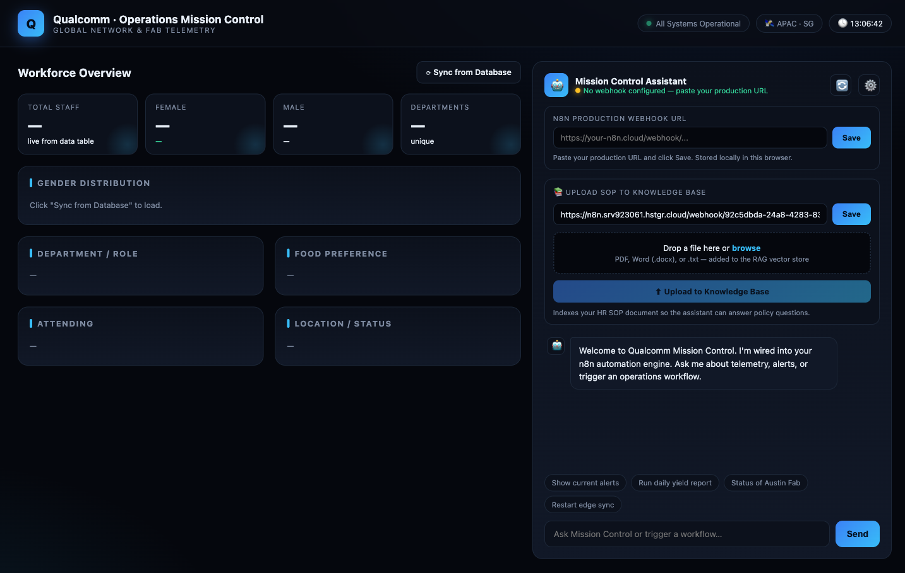

<div align="center">

# Agentic AI Automation with n8n

[](https://www.tertiarycourses.com.sg/wsq-agentic-ai-automation-with-n8n.html)
[](https://n8n.io)
[](https://platform.openai.com)
[](#activity-4--rag-chatbot-with-vector-store--file-upload)
[](#license)

**Hands-on lab workflows and web apps for building agentic AI automations with n8n — from form-to-email flows to a RAG chatbot with a vector store.**

[📘 Course Page](https://www.tertiarycourses.com.sg/wsq-agentic-ai-automation-with-n8n.html) · [📖 Step-by-Step Guide](LEARNER-GUIDE.md) · [🐛 Report Bug](https://github.com/tertiarycourses/TGS-2023035977-Agentic-AI-Automation-with-n8n/issues) · [💡 Request Feature](https://github.com/tertiarycourses/TGS-2023035977-Agentic-AI-Automation-with-n8n/issues)

</div>

> [!NOTE]
> **These are the official hands-on lab materials for the WSQ course:**
> ### 🎓 WSQ — Agentic AI Automation with n8n
> **Course Code:** `TGS-2023035977` · by Tertiary Courses / Tertiary Infotech
> **Course page:** https://www.tertiarycourses.com.sg/wsq-agentic-ai-automation-with-n8n.html

---

## Screenshot

> Activity 4 — RAG "Operations Mission Control" dashboard: a live workforce panel (powered by an n8n Data Table) alongside a chatbot that answers HR-policy questions from an uploaded SOP document via a vector store.



---

## About

This repository contains the complete, working lab materials for the **WSQ Agentic AI Automation with n8n** course (**TGS-2023035977**) by Tertiary Courses / Tertiary Infotech. Each activity is a self-contained, importable [n8n](https://n8n.io) workflow — several paired with a polished HTML front end — that builds progressively from basic automation to a full **Retrieval-Augmented Generation (RAG)** agent.

### What you'll learn

| # | Activity | Concepts |
|---|----------|----------|
| **1** | **Workflow Automation with Forms** | Form Trigger → Gmail, expressions, IF-node branching, n8n Data Tables |
| **2** | **Build an AI Agent** | Chat Trigger, AI Agent + OpenAI model, memory, tools (Tavily search + Data Table) |
| **3** | **Webhook + Custom Web UI** | Webhook trigger, CORS, `Respond to Webhook`, decoupling a branded front end from the workflow |
| **4** | **RAG Chatbot** | Vector store ingestion, embeddings, document loaders, file upload, tool routing via the system prompt |
| **5** | **Multi-Agent Routing** | A router that dispatches to specialist HR and IT agents, each with its own vector store + Data Table tools, behind one webhook + dashboard |

> 📖 **Full walkthrough:** see **[LEARNER-GUIDE.md](LEARNER-GUIDE.md)** for detailed, click-by-click instructions for every activity, plus a troubleshooting cheat-sheet and glossary.

---

## Tech Stack

| Category | Technology |
|----------|------------|
| **Automation Platform** | [n8n](https://n8n.io) (workflows, triggers, Data Tables) |
| **LLM** | OpenAI (`gpt-4.1-mini` chat model + `text-embedding` embeddings) |
| **Agent Framework** | n8n LangChain nodes (AI Agent, Memory, Vector Store) |
| **Tools** | Tavily (web search), n8n Data Table, In-Memory Vector Store |
| **Email** | Gmail (OAuth2) |
| **Front End** | Vanilla HTML / CSS / JavaScript (no build step) |
| **Docs** | Markdown guide + generated Word SOP (`python-docx`) |

---

## Architecture

```
ACTIVITY 1 — Forms                ACTIVITY 2 — AI Agent
┌──────────────┐                  ┌────────────────────┐
│ Form Trigger │                  │   Chat Trigger     │
└──────┬───────┘                  └─────────┬──────────┘
       ▼                                    ▼
   ┌───────┐  true  ┌────────┐        ┌──────────┐   ┌──────────────┐
   │  IF   ├───────▶│ Gmail  │        │ AI Agent ├──▶│  reply        │
   └───┬───┘        └────────┘        └────┬─────┘   └──────────────┘
       │ false                            ├─ OpenAI Chat Model
       ▼                                  ├─ Simple Memory
   ┌──────────┐                           ├─ Tavily (web search)
   │Data Table│                           └─ Data Table (employee data)
   └──────────┘

ACTIVITY 3 — Webhook + Web UI          ACTIVITY 4 — RAG
┌──────────┐   ┌──────────┐            INGEST:  Webhook ─▶ Vector Store (Insert "sop")
│  Webhook │──▶│ AI Agent │──▶ Respond           ├─ Embeddings OpenAI
└────┬─────┘   └────┬─────┘    to Webhook         └─ Default Data Loader (file upload)
  HTML page         ├─ OpenAI Chat Model
  posts JSON        ├─ Tavily               CHAT:   Webhook ─▶ AI Agent ─▶ Respond
                    └─ Data Table                    ├─ Data Table (employees)
                                                      ├─ Vector Store retrieve ("sop") → SOP answers
                                                      └─ Tavily (fallback)


ACTIVITY 5 — Multi-Agent Routing
┌──────────┐     ┌──────────────┐      ┌── HR Agent ──┐  ├─ HR SOP vector store
│  Webhook │ ──▶ │ Router Agent │ ──┬─▶│              │  └─ HR Employee Data Table
└────┬─────┘     └──────────────┘   │  └──────────────┘
  Dashboard +                       │  ┌── IT Agent ──┐  ├─ IT FAQ vector store
  chat UI posts JSON                └─▶│              │  └─ IT Tickets Data Table
                                       └──────┬───────┘
                                              └──▶ Respond to Webhook
```

---

## Project Structure

```
TGS-2023035977-Agentic-AI-Automation-with-n8n/
├── LEARNER-GUIDE.md                  # Full step-by-step lab guide (start here)
├── README.md
├── screenshot.png                   # Activity 4 dashboard
│
├── activity1-automation/            # Forms → Email → Conditional → Data Table
│   ├── Activity1a_ Design a Flyer with n8n form embedded.json
│   ├── Activity1b_ Improved Flyer with Conditonal Route.json
│   └── Activity1c_ Improved Flyer with Data Table.json
│
├── activity2-ai-agent/              # Chat-based AI Agent with tools + memory
│   └── Activity2-AI Agent.json
│
├── activity3-webhook/               # Webhook-exposed agent + custom dashboards
│   ├── Acitivty3-Webhook.json
│   └── index.html, index1–4.html    # Branded chat UIs (design variants)
│
├── activity4-rag/                   # RAG: vector store + file upload + dashboard
│   ├── Activity4-RAG.json
│   ├── index.html                   # Dashboard + chatbot + SOP uploader
│   ├── make_sop.py                  # Generates the sample HR SOP
│   └── MyCompany-HR-SOP.docx        # Sample document to upload into the vector store
│
├── activity5-multi-agents/          # Multi-agent router: HR + IT specialist agents
│   ├── Activity5-MultiAgents.json
│   ├── index.html                   # HR & IT "Mission Control" dashboard + chat
│   ├── make_it_faq.py               # Generates the sample IT Support FAQ
│   ├── MyCompany-HR-SOP.docx        # HR SOP for the HR agent's vector store
│   └── MyCompany-IT-Support-FAQ.docx# IT FAQ for the IT agent's vector store
│
└── mini-projects/
    └── issue-tracking/              # Issue Reporting: n8n form + image → Postgres
        ├── issue-report-postgresql.json   # Submission workflow
        ├── issue-reports-api.json         # Retrieval API workflow
        ├── schema.sql                     # Postgres issue_reports table
        ├── index.html, gallery.html       # QR/landing + report gallery pages
        └── README.md
```

---

## Getting Started

### Prerequisites
- An [**n8n**](https://n8n.io) account (Cloud or self-hosted)
- An [**OpenAI API key**](https://platform.openai.com/api-keys)
- A [**Tavily API key**](https://tavily.com) (web-search tool)
- A **Gmail** account (for Activity 1 email)
- A modern browser (for the Activity 3, 4 & 5 web pages)
- *(Optional, for the Issue Reporting mini-project)* a **Postgres** database (e.g. [Supabase](https://supabase.com))

### 1. Clone the repo
```bash
git clone https://github.com/tertiarycourses/TGS-2023035977-Agentic-AI-Automation-with-n8n.git
cd TGS-2023035977-Agentic-AI-Automation-with-n8n
```

### 2. Import a workflow into n8n
1. In n8n: **Workflows → Add workflow → ⋯ → Import from File**.
2. Pick a `.json` from the matching `activity*/` folder.
3. Re-select **your own credentials** (OpenAI, Tavily, Gmail) on each node — imported credential IDs won't match yours.
4. **Save**, then toggle **Active / Published**.

### 3. Run the web apps (Activities 3, 4 & 5)
The pages are pure static HTML — just open them, or serve locally:
```bash
cd activity4-rag
python3 -m http.server 8000
# then open http://localhost:8000/index.html
```
- Click the **⚙️ gear** and paste your **chat webhook** production URL.
- In Activity 4, also paste your **upload webhook** URL in the Knowledge Base card, then drag in `MyCompany-HR-SOP.docx` to populate the vector store.
- In Activity 5, populate **both** vector stores: upload `MyCompany-HR-SOP.docx` (HR agent) and `MyCompany-IT-Support-FAQ.docx` (IT agent), then ask an HR or IT question and watch the router dispatch to the right specialist.

> ⚠️ **CORS:** each n8n Webhook node must have **Options → Allowed Origins (CORS) = `*`** so the browser page can call it. All workflow exports in this repo already include this.

For complete, click-by-click setup, see **[LEARNER-GUIDE.md](LEARNER-GUIDE.md)**.

---

## Contributing

Contributions, fixes, and improvements are welcome:

1. **Fork** the repository
2. Create a feature branch: `git checkout -b feature/my-improvement`
3. Commit your changes: `git commit -m "Add my improvement"`
4. Push the branch: `git push origin feature/my-improvement`
5. Open a **Pull Request**

Found a bug or have an idea? Open an [issue](https://github.com/tertiarycourses/TGS-2023035977-Agentic-AI-Automation-with-n8n/issues).

---

## License

This material is provided for **educational use** as part of the WSQ course **TGS-2023035977**. © Tertiary Infotech Pte. Ltd. All rights reserved.

---

## Developed By

**Tertiary Infotech Pte. Ltd.** — [Tertiary Courses](https://www.tertiarycourses.com.sg)
Course: [WSQ Agentic AI Automation with n8n (TGS-2023035977)](https://www.tertiarycourses.com.sg/wsq-agentic-ai-automation-with-n8n.html)

## Acknowledgements

- [n8n](https://n8n.io) — the workflow automation platform
- [OpenAI](https://openai.com) — chat & embedding models
- [Tavily](https://tavily.com) — AI web-search API
- Course trainers and learners of TGS-2023035977

---

<div align="center">

⭐ **If this helped you learn agentic automation, star the repo!**

[📘 Course Page](https://www.tertiarycourses.com.sg/wsq-agentic-ai-automation-with-n8n.html) · [📖 Step-by-Step Guide](LEARNER-GUIDE.md)

</div>
